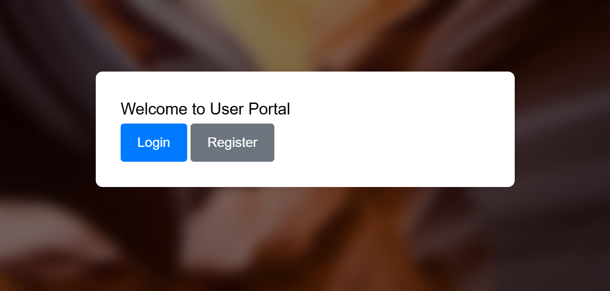
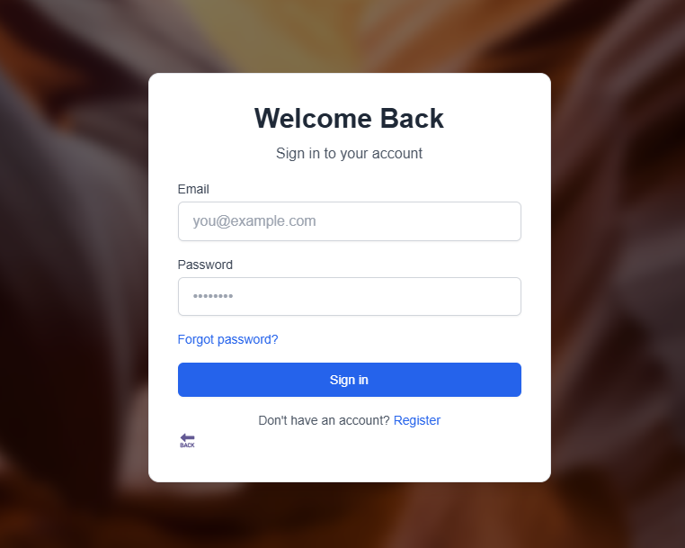
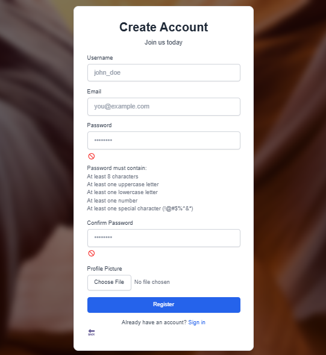
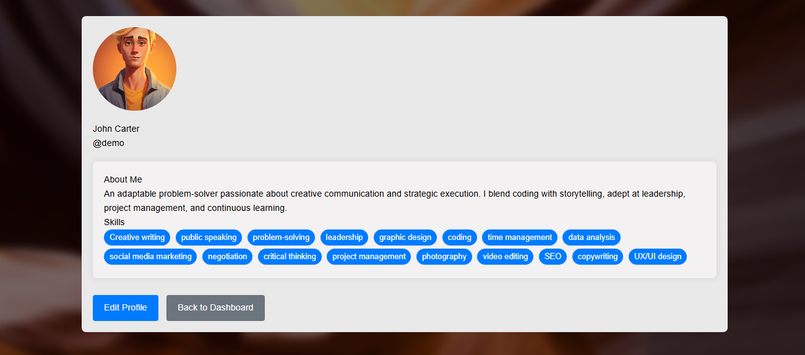

# User Authentication System

This project is a comprehensive User Authentication System developed using HTML, CSS, JavaScript, and Python. It provides secure and efficient user registration, login, and authentication capabilities.

## Table of Contents

- [Demo](#demo)
- [Features](#features)
- [Technologies Used](#technologies-used)
- [Database](#database)
- [Installation](#installation)
- [Usage](#usage)
- [Contributing](#contributing)

- ## Demo

|  |  |  |  |
|:---:|:---:|:---:|

## Features

- **User Registration**: Allows users to create new accounts.
- **User Login**: Authenticates users and grants access to protected resources.
- **Password Encryption**: Ensures passwords are securely stored.
- **Session Management**: Manages user sessions to maintain login state.

## Technologies Used

- **HTML**: Provides the structure of the web pages.
- **CSS**: Adds styling to the web pages.
- **JavaScript**: Implements frontend functionality and form validation.
- **Python**: Handles backend logic and server-side processing.

## Database

The project includes a database component to store user information securely. The database schema and related files are located in the `Database` directory. Ensure to set up the database as per the instructions provided in the `Database` directory before running the application.

## Installation

To set up the project locally, follow these steps:

1. Clone the repository:
    ```bash
    git clone https://github.com/Norozahmed/User-authentication-system.git
    ```

2. Navigate to the project directory:
    ```bash
    cd User-authentication-system
    ```

3. Create a virtual environment:
    ```bash
    python -m venv venv
    ```

4. Activate the virtual environment:
    - On Windows:
        ```bash
        venv\Scripts\activate
        ```
    - On macOS/Linux:
        ```bash
        source venv/bin/activate
        ```

5. Install the required dependencies:
    ```bash
    pip install -r requirements.txt
    ```

6. Set up the database:
    - Follow the instructions provided in the `Database` directory to set up the database.

## Usage

1. Start the application:
    ```bash
    python app.py
    ```

2. Open your web browser and navigate to `http://localhost:5000`.

## Contributing

We welcome contributions! Please open an issue to discuss any changes or improvements you would like to make.
